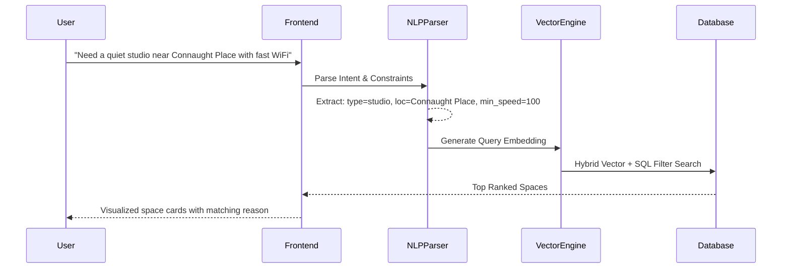

# AI & Concierge (LoopBot) Architecture

## Overview
LoopBot is an intelligent workspace concierge designed to translate free-form user intents into structured search parameters and personalized space recommendations.

## Guardrails & Fallback
- If the AI LLM service is degraded, LoopBot gracefully degrades to regex-based keyword extraction and popularity-ranked database listings without failing user requests.
