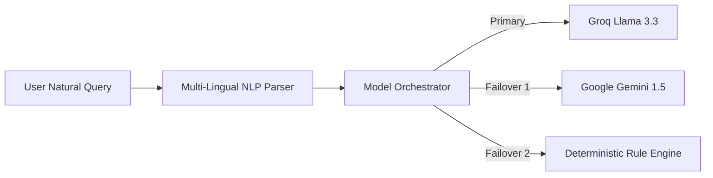

# AI Architecture & LoopBot Orchestration

## Multi-LLM Routing Pipeline

```mermaid
flowchart LR
    UserQuery[User Natural Query] --> Parser[Multi-Lingual NLP Parser]
    Parser --> LLMRouter[Model Orchestrator]
    LLMRouter -- Primary --> Groq[Groq Llama 3.3]
    LLMRouter -- Failover 1 --> Gemini[Google Gemini 1.5]
    LLMRouter -- Failover 2 --> RuleEngine[Deterministic Rule Engine]
```

Supports English, Hindi, Hinglish, and Marathi queries.
