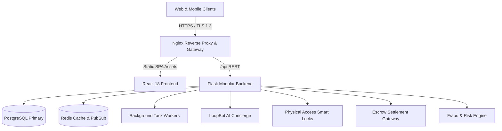

# SpaceLoop System Architecture

## Core Tenets
1. **Separation of Concerns**: Clean presentation layer with full-width responsive UX, decoupled from microservice modules.
2. **Deterministic Security**: Zero client-side trust; physical smart access credentials only generated after escrow confirmation.
3. **Resilience**: Redis caching for search pipelines with background asynchronous task processing for email/webhooks.
