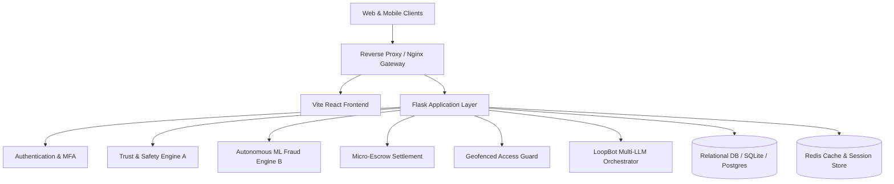

# SpaceLoop System Architecture

## High-Level Topology
SpaceLoop is architected as an event-aware, clean-layered peer-to-peer storage and workspace sharing marketplace.

## Core Design Principles
1. **Separation of Concerns**: UI presentation never executes authoritative business rules or financial pricing.
2. **Deterministic Fallbacks**: Every AI and ML component features hard deterministic fallbacks when external LLMs or serialized model artifacts are unavailable.
3. **Idempotency & Double-Release Protection**: Micro-escrow and booking access states transition deterministically.
